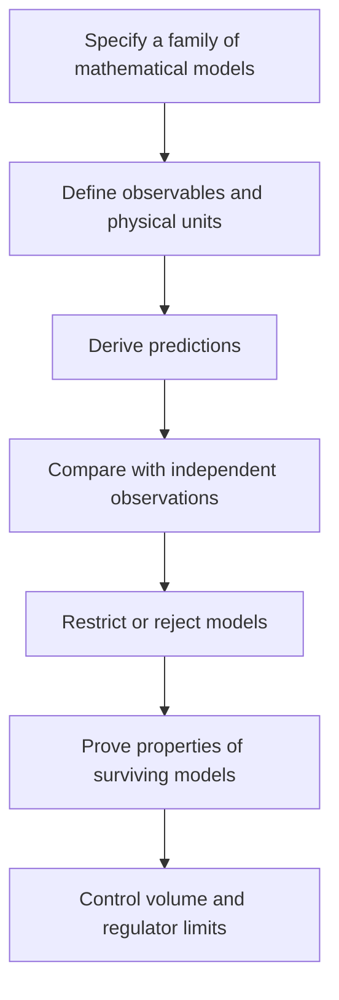

# Space, mathematical reality, and what a Yang–Mills proof would establish

**Research discussion — 15 September 2026**

## Direct answer

There is a useful inverse problem in the proposal: infer mathematical laws from observations, then prove what those laws imply. But the spacing chosen in our current calculation is part of its construction. Recovering that chosen input from the resulting output would not establish why physical space exists or why nature follows those laws.

The present code specifies a gauge model on a graph. It computes consequences of those assumptions. A successful Yang–Mills proof would establish the required quantum theory and its gap; it would not, by itself, establish that all physical existence is mathematical, that every mathematical universe exists, or that space is executed by an underlying program.

## 1. What “space” means in the current code

| Item | Role in the calculation |
|---|---|
| Vertices, links and faces | Specify which degrees of freedom interact and which products form plaquette loops. |
| Spatial dimension and geometry | Chosen through the lattice construction; three coordinate directions are part of this setup. |
| Gauge group SU(2) | Defines the local gauge variables and their representation rules. |
| Electric and magnetic coefficients κ and ν | Define the Hamiltonian's energy scale and relative interaction strength. |
| Physical lattice spacing a | A regulator length in a continuum interpretation; no value in metres has been inferred here. |
| Spin or electric-energy cutoff | Makes a finite computation possible; omitted states must be controlled. |
| Gap E₁−E₀ | An output of that specified model. |
| Continuum and volume limits | Mathematical work still needed to connect the approximations to the target theory. |

Our numerical matrices currently use κ=1 and specified ν/κ. They have no independently calibrated physical length attached. Integer vertex coordinates label positions and adjacency. They do not demonstrate that the universe has a grid whose physical spacing equals one.

Even the numerical value of an energy depends on units. If H is replaced by sH, every energy difference is multiplied by s, while the Hilbert space and its state relations are unchanged. A numerical gap alone therefore cannot identify an absolute physical length or a unique underlying geometry.

### Three operations that must be distinguished

1. **Change units.** Describe the same lengths using centimetres instead of metres. The numerical labels change; the physical predictions do not.
2. **Increase volume.** Add more cells while keeping the regulator spacing and couplings fixed. The system occupies a larger region. This is the joined-cube test.
3. **Refine the regulator.** Decrease a while adding cells to keep a chosen physical region fixed. Adjust the bare coupling appropriately so the approximations describe the same physical theory. This adjustment is renormalization.

For example, if a physical box has side L and N cells across it, a=L/N. Doubling N at fixed L halves the regulator spacing. Doubling N at fixed a doubles the box size. These are different tests and can have different spectral consequences.

A dimensionless lattice energy can approach zero as a decreases while a physical mass remains positive. One must compare in a consistent physical scale. Requiring the same raw dimensionless number at every regulator spacing would generally test the wrong condition.

The official problem prescribes a theory on four-dimensional spacetime with the stated axiomatic properties and a positive gap. It does not ask for a derivation of the existence of space or the number of spacetime dimensions from a theory of all reality. [Jaffe and Witten, *Quantum Yang–Mills Theory*](https://www.claymath.org/wp-content/uploads/2022/06/yangmills.pdf)

## 2. “The rock has mathematical properties” versus “the rock is mathematical structure”

The second view resembles Max Tegmark's **Mathematical Universe Hypothesis**: external physical reality is an abstract mathematical structure. Tegmark presents and argues for that hypothesis; it is not an established consequence of a successful numerical physics calculation. [Tegmark, *The Mathematical Universe*](https://arxiv.org/abs/0704.0646)

On that interpretation, a rock can still be a real pattern within the larger structure. Describing its ontology differently need not imply that observations of rocks are illusory. The central issue is whether mathematical description and physical existence are identical.

For the current project, changing from “has” to “is” does not alter the spectrum if the mathematical model, observables and predictions remain the same. To produce a new mathematical route to the gap, the interpretation would need to supply an additional constraint, construction or estimate that we can state precisely.

There is also a distinction between a mathematical structure and a computer program. The former does not automatically come with an algorithm that generates or decides all of its properties. Tegmark discusses a separate, more restrictive computable-universe proposal; computability is an additional assumption. [Tegmark](https://arxiv.org/abs/0704.0646)

## 3. Level IV: a collection of possible mathematical worlds

Tegmark's Level IV proposal allows other mathematical structures to have different fundamental laws. His discussion also identifies a measure problem: how to assign probabilities or typicality so the collection can yield predictions. [Tegmark, *Parallel Universes*](https://arxiv.org/abs/astro-ph/0302131)

“The library of all truths” is a useful metaphor, but it is not a selection rule for our Hamiltonian. Truths about one structure do not automatically hold in a different structure. Different geometries, dimensions and dynamics can coexist in the proposal without being mixed into one contradictory mathematical system.

Applied to our research question, merely allowing all structures does not determine:

- Why this gauge group and interaction occur.
- Which structure and observers should be considered typical.
- Why a measured dimensionless parameter has its value.
- Whether the selected theory has a positive gap.

A useful physical version would need a specified collection of models, a justified rule for assigning weights or selecting observations, and predictions that can distinguish it from alternatives. The Level IV idea alone gives none of the missing gap estimates in the present calculation.

## 4. Gödel: a limit on complete formal methods

In its modern form, the first incompleteness theorem applies to a consistent, effectively axiomatized formal system containing enough elementary arithmetic to represent computations. Such a system cannot decide every arithmetical statement. “Effectively axiomatized” means that its axioms can be generated or recognized by an appropriate algorithm. Gödel's original work and Rosser's strengthening establish this family of limitations. [Gödel's original paper](https://doi.org/10.1007/BF01700692), [Rosser, *Extensions of Some Theorems of Gödel and Church*](https://www.cambridge.org/core/journals/journal-of-symbolic-logic/article/abs/extensions-of-some-theorems-of-godel-and-church/0461E34DC1F219C459EE84CC2FA89068)

This is not a claim that every difficult problem is unprovable. It does not establish that Yang–Mills is independent of the usual mathematical axioms, that reality is inconsistent, or that a finite gap certificate is impossible. Many particular statements remain provable in an incomplete system.

The distinction is between one specified problem and an algorithm guaranteed to settle every problem in a sufficiently broad class. Our finite-matrix and omitted-state certificates concern particular, explicit operators and inequalities.

### There is a direct spectral-gap connection

Cubitt, Perez-Garcia and Wolf constructed families of two-dimensional quantum spin systems for which no algorithm can determine the presence of a gap in every case. Their construction encodes a halting problem and uses aperiodic tilings. It concerns an infinite-system decision problem, and shows that a universal gap-solving algorithm is impossible for that family. [*Undecidability of the Spectral Gap*](https://arxiv.org/abs/1502.04135)

That theorem does not identify the specific four-dimensional Yang–Mills problem as undecidable. The distinction matters: the existence of deliberately constructed undecidable models is not an undecidability proof for every natural field theory.

Gödel is therefore relevant to the ambition of a complete “library solver.” It is not a reason to stop trying to prove a particular estimate for the Yang–Mills Hamiltonian.

## 5. How to make the reverse-engineering idea concrete

The useful program is:

For a proposal in which space itself emerges, additional definitions would be needed: what the fundamental objects are, which relations count as distance, what defines evolution, and how an approximately three-dimensional space with relativistic time appears. Those definitions must yield quantitative predictions before they can be checked.

The current Yang–Mills program begins farther along: it specifies gauge dynamics and the target spacetime setting, then asks whether the quantum theory can be constructed and whether its vacuum is separated from excitations by a positive energy.

The practical next question is therefore **which features of the results survive changes to our approximation and to our representation of the same physical model?** For joined cubes, this includes keeping all legitimate gauge-coupling states, changing the way those states are represented, increasing the basis, and controlling the growing-volume limit. These tests can expose assumptions put in by hand without requiring an answer to the ontology of mathematics first.
